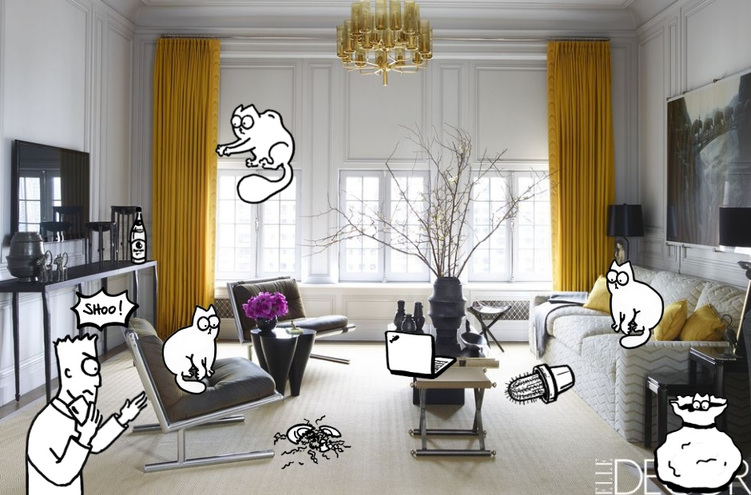

# shooshoo
A silly HTML game made with [Tito](https://www.jer.design) at the [Berlin Mini Game Jam](http://berlinminijam.de). Play it at [shone.dev/shooshoo](https://shone.dev/shooshoo)

Instructions: one player drags cats from the bag onto objects in the room. The other player moves Simon with the arrow keys and shoos cats away with spacebar before they can knock everything over.

